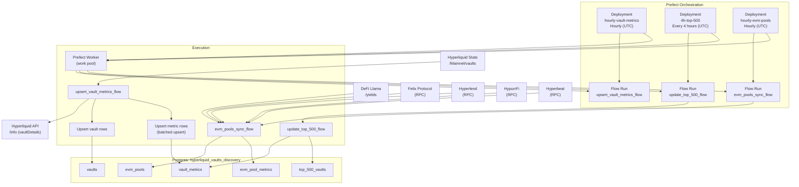

# Data Ingestion Overview

This project ingests Hyperliquid and HyperEVM vault metadata and performance metrics into Postgres on a schedule using Prefect.

## Data sources

The ingestion system uses a hybrid approach to gather data:

1.  **Hyperliquid Stats & API**:
    *   Vault list (canonical): `https://stats-data.hyperliquid.xyz/Mainnet/vaults`
    *   Per-vault details: `POST https://api.hyperliquid.xyz/info`

2.  **DeFi Llama**:
    *   Broad EVM pool discovery via `https://yields.llama.fi/pools`.

3.  **Direct RPC (HyperEVM)**:
    *   Protocol-specific clients (Felix, Hyperlend, HypurrFi, Hyperbeat) connect directly to the HyperEVM JSON-RPC (`https://rpc.hyperliquid.xyz/evm`) to fetch granular risk parameters and borrow metrics.

## What gets stored

it stores data in the `hyperliquid_vaults_discovery` schema:

- `vaults` / `vault_metrics`: Native Hyperliquid vaults (HLP, etc.).
- `top_500_vaults`: Derived ranking of native vaults.
- `evm_pools` / `evm_pool_metrics`: HyperEVM ecosystem pools (Lending, CDPs, Vaults).

## Periodic runs

Two scheduled deployments are defined in `scripts/deploy_prefect_flows.py`:

- `hourly-vault-metrics` — runs `upsert_vault_metrics_flow` hourly (UTC)
- `4h-top-500` — runs `update_top_500_flow` every 4 hours (UTC)
- `hourly-evm-pools` — runs `sync_evm_pools_flow` hourly (UTC) to sync external EVM pools.

## End-to-end flow (Mermaid)

## Important operational details

- **Rate limiting + retries:** detail fetches are throttled via a global async rate limiter (`requests_per_second`) with backoff/jitter for retryable errors.
- **Batching DB upserts:** writes are chunked to avoid the `asyncpg` bind-parameter limit (32,767 parameters).
- **Missing values:** if a vaultDetails payload omits fields (e.g., `maxDistributable`), ingestion stores NULL rather than inventing a value.

Next: see [Prefect Flows](prefect-flows.md) for parameters (`concurrency`, `requests_per_second`, etc.) and [Database](database.md) for schema/model details.
